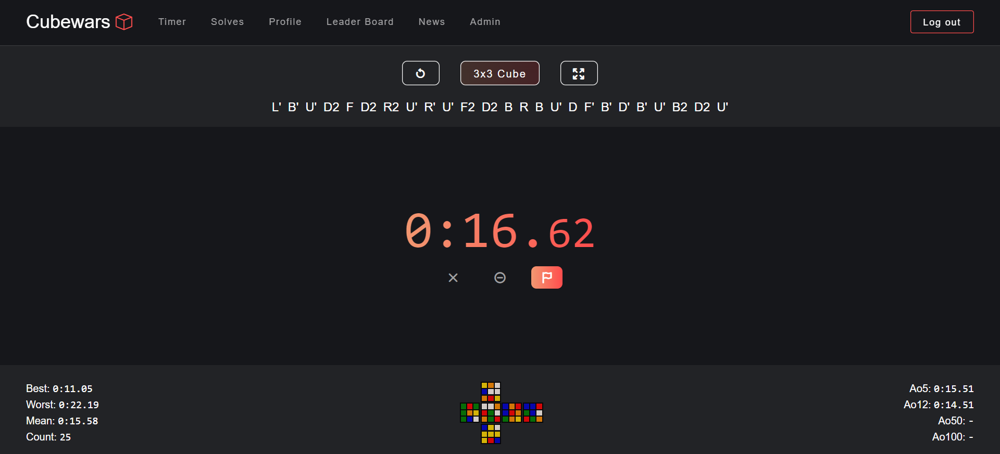
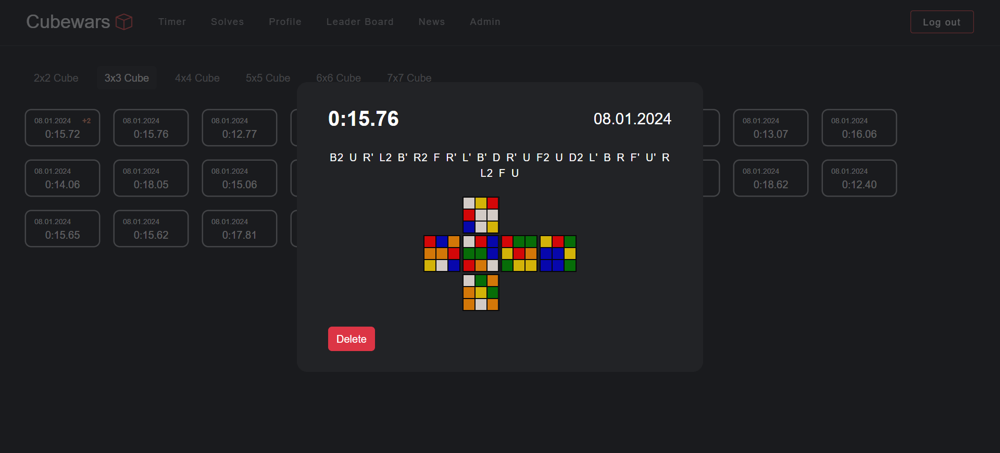
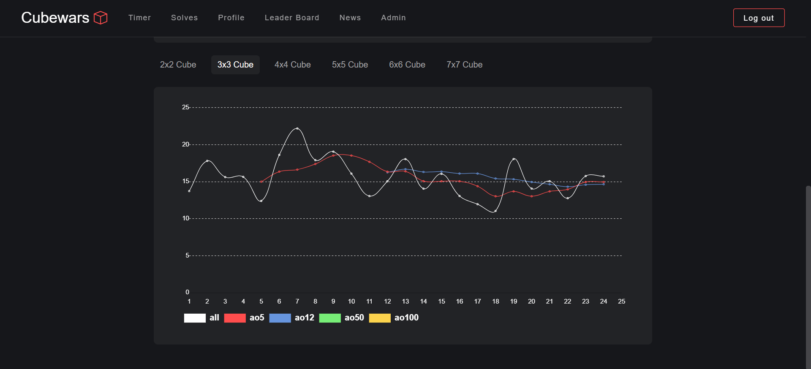
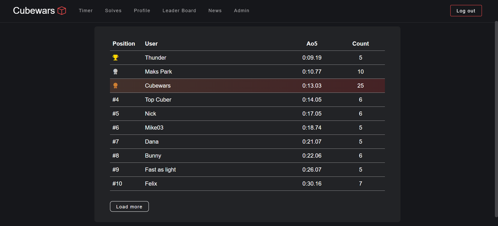

# Cubewars

Cubewars combines a user-friendly interface with powerful functionality, creating an engaging platform for speedcubers to sharpen their skills, analyze their performance, and connect with a vibrant community.

## Features

- **Advanced Timer:** Experience a feature-rich timer for solving puzzles, tailored specifically for speedcubers.

- **Statistical Analysis:** Dive into extensive statistics based on solves, providing users with insightful data about their performance.

- **Competitive Leaderboard:** Challenge fellow users on the competitive leaderboard, showcasing the fastest cubers in the community.

- **News Feed:** Stay connected with the community through a news feed where admins can post updates, and users can like and comment on them.

- **Admin Privileges:** Admins have the ability to write posts, manage the news feed, and download statistics in PDF, Word, or Excel formats.

## Technologies

- **Front-end:** HTML, SCSS, JavaScript, jQuery, Ajax
- **Back-end:** Java 11, Spring Boot (Web, Security, JDBC, Validation), Lombok, JUnit, Mockito
- **Database:** PostgreSQL, Flyway

## Screenshots

  
  